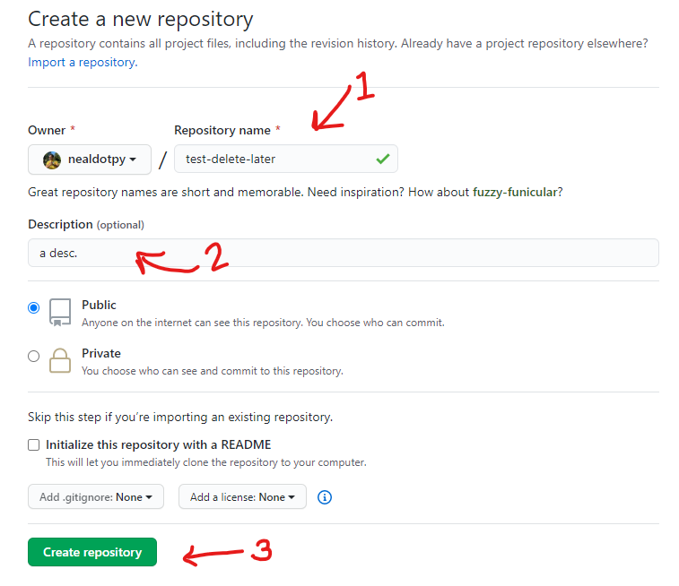
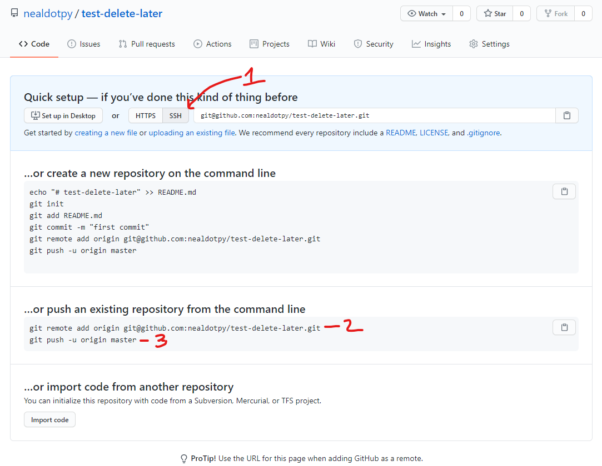

# git & GitHub

### Basic definitions

Firstly, it's important to understand the distinction:

* **git** - is a free and open source distributed version control system designed to handle everything from small to very large projects with speed and efficiency.

* **GitHub** - is a United States-based global company that provides hosting for software development and version control using Git. It has been a subsidiary of Microsoft since 2018. It offers the distributed version control and source code management functionality of Git, plus its own features. 

### How does git work?

Here's a good way to think about git:
* git is a version control system, which means that it allows you to look at the timeline of a project past and present.
* git acts as a tree, where master is usually the root/default trunk. every branch that you make off of master will act as a copy of master in that point and time. It will allow you to make changes to a branch (such as editing a file, deleting files, adding files) without ever effecting the master branch.
* You generally never edit master. master is where you keep working, production-grade code (in formal projects that is).
* Once you intialize your repo, a `.git` hidden directory will appear in your root directory if you use `$ ls -a` to list all the files/dirs. This is where your "timeline" is stored.
* Only files tracked by git will actually take part of this "timeline" functionality.

### Basic git commands

Now here are some helpful git commands:

* `$ git status` will tell you the status of your repo 
* `$ git add -A` will add **all** current working directory files not __tracked__ by your repo to its list of tracked files.
* `$ git commit path/to/file/<filename> -m "<brief, detailed commit message>` will commit a specific file that you have told git to track. **You cannot commit files that aren't tracked.**
* `$ git commit -am "<brief, detailed commit message>` will commit all files in the current working directory that have been changed in some way and are currently tracked. This is what I commonly use.
* `$ git log` will show a log of commits. `:q` to quit this file stream. `$ git log --oneline` is often enough information and easier to read. `$ git log --all --decorate --oneline --graph` can be used to show a terminal based tree of the entire repository. For small projects this won't matter as much, `--oneline` is enough.

### Using git

When in the root directory of your project (before you begin the project), use `$ git init` to initialize your git repository. Add your first file: `$ touch README.md`, and edit that file using a text editor of your choice. Copy the following into it and save:

```md
# Header

## Sub Header

This is my first README.md!

## Project

* Create C Program to process student grade data.
* Make money!
```

* Run: `$ git status`. This will notify you that there is an untracked file it has detected, the file you just made!
* Once you're done editing that file, you need to tell git to track it: `$ git add -A`.
* Run: `$ git status`. Now that you've tracked the file, git tells you there are changes that need to be committed.
* Now, commit the changes you've made. Run: `$ git commit -am "created README.md!"`.
* `$ git status` will now show that you've got no new files that potentially need to be tracked. In addition, there is "`nothing to commit, working tree clean`"

So once you've followed these steps, you have technically edited, saved, and committed to the master branch. This is generally bad practice. However, since this project is *extremely* small, we'll allow it. However, going forward, we'll talk more about branching and merging.

### Now what

Okay so you've committed changes to your local repo. Now what? Well, that's where GitHub comes in. GitHub allows you to store your entire repository in the cloud & look into its past and see the state of the repository at any given commit. Notice, you can only wind the clock back according to commits.

**This is an important concept. If you can only traverse the history of a repository by commit, then you should commit when significant changes have been made. More accurately, you should commit whenever meaningful work has been done, no matter how small. You can always 'squash' commits down the road to condense 10 verbose commits into 1. You cannot, however, expand 1 commit into 10.**

So you have a GitHub account right? Well what do you do with it?!

### The GitHub Chad

Before you can push and pull to private repositories hosted on GitHub, you will need to create an SSH public/private key pair. This will allow you to give a public key to GitHub (think of it as a padlock) that GitHub can use to authenticate your requests in addition to or in lieu of your GitHub username and password. It's sufficient to think of this key-based authentication process as you unlocking the public key (i.e., the padlock) using your private key -- the Git program will do this with GitHub so long as the key pair is setup correctly.

1. Before you type the following command, please note that it will prompt you to answer questions. Do NOT change any values when prompted -- simply press return until the command is finished executing. **Simply press return when asked for a password.** With that in mind, please execute the command below, replacing your_email@gmail.com with your email address.

	`$ ssh-keygen -t rsa -b 4096 -C "your_email@gmail.com"`

	This creates a public/private key pair in the default location: `~/.ssh/.`

2. View your public key using cat and copy its output to your clipboard (usually by selecting the text in your terminal, then right clicking on the selection and clicking "Copy"):

	`$ cat ~/.ssh/id_rsa.pub`


3. Log into **<a target="_blank" href="https://github.com">GitHub<a>**.

4. In the upper-right corner of any page, click your profile photo, then click Settings.

5. In the user settings sidebar, click **SSH and GPG keys**.

6. Click **New SSH key or Add SSH key**. 

7. In the "Title" field, add a descriptive label for the new key.

8. Paste your key into the "Key" field. This should be the copied output from your prior call to `cat`.

9. Click **Add SSH key**. Enter password if prompted.

### GitChad

Go to your GitHub account and create a new repository called "student-reporter".

<p align="center">
	
</p>

GitHub will show you a screen that looks much like this one:

<p align="center">
	
</p>

See, now that you've already committed changes to your **local** repo previously, you're already ready to *push* them to the **remote** repo.

But first you need to tell your local repo where to find remote repo. In addition, the `ssh-keygen` command you ran earlier saved your ssh key in a default folder. git will look for these credentials there as well.

So you'll copy and paste (2) in the above screenshot into your terminal in your current working directory. This will tell your local `.git` where the remote is. Next, you'll copy and execute (3) from above screenshot to actually *physically* push your entire committed local repo to GitHub.

Once your `git push` command returns in terminal. Refresh your GitHub page.

Since you've told your local repo **exactly** where to push using `$ git push -u origin master`, all subsequent pushes can be shortened to `$ git push`. Remember, you can only push after all the files you want in a "timeline" have been tracked **and** you've committed local changes to your local repo. 

`$ git push` is usually executed when you've finished a stretch of your working day or you've finished something that someone else needs.

